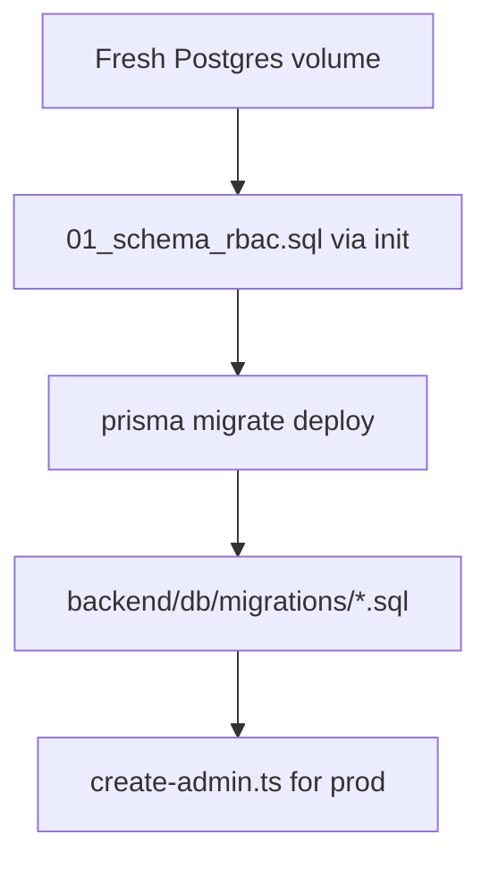

# Database migrations — AssetCore

## Overview

AssetCore uses three layers (historical). **Deploy order matters.**



## 1. Initial schema (first boot only)

[`infra/postgres/init/01_schema_rbac.sql`](../infra/postgres/init/01_schema_rbac.sql) runs automatically when Postgres creates a new volume:

- Extensions, enums, core tables
- Roles, permissions, menus, SLA, support topics
- **No demo users or assets**

Development only: [`02_seed_dev.sql`](../infra/postgres/init/02_seed_dev.sql) adds demo users (`admin123` / `tecnico123`) and sample assets.

Production compose mounts **only** `01_schema_rbac.sql`.

## 2. Prisma migrations

Located in [`backend/prisma/migrations/`](../backend/prisma/migrations/).

```bash
cd backend
npx prisma migrate deploy
```

## 3. Supplemental SQL

Idempotent patches in [`backend/db/migrations/`](../backend/db/migrations/), applied in filename order by:

```bash
./backend/scripts/migrate-deploy.sh
```

| File | Purpose |
|------|---------|
| `20260317_helpdesk_config.sql` | Helpdesk config tables |
| `20260318_ticket_states_attachments.sql` | Ticket attachments |
| `20260319_refresh_tokens.sql` | Refresh token storage |
| `20260320_projects_gantt.sql` | Projects / Gantt |
| `20260323_reports_menu.sql` | Reports menus |
| `20260702_asset_decommission.sql` | Asset decommission fields |
| `20260703_depreciation_lisr.sql` | Depreciation MOI / rates |

## Production first deploy

```bash
# After postgres is healthy and backend image is built:
docker compose -f docker-compose.prod.yml exec backend ./scripts/migrate-deploy.sh
docker compose -f docker-compose.prod.yml exec backend npx tsx scripts/create-admin.ts
# Set ADMIN_EMAIL, ADMIN_PASSWORD via env or -e flags
```

## Backup / restore

See [`docs/PRODUCTION.md`](PRODUCTION.md) and [`infra/scripts/backup-db.sh`](../infra/scripts/backup-db.sh).
